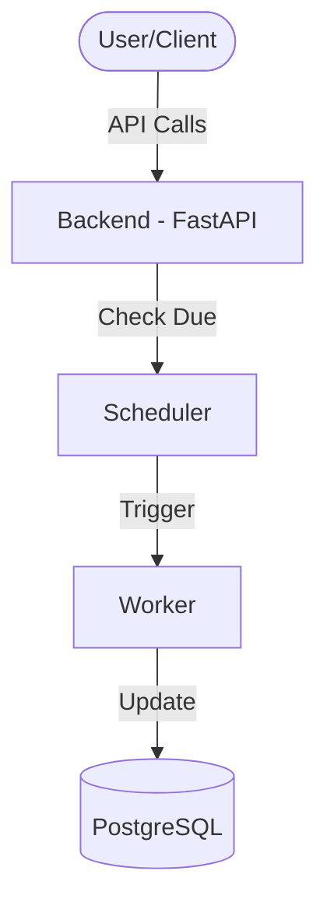

# Marketing Campaign Management System

## Overview
A robust backend for creating, scheduling, and managing marketing campaigns (Email, Push, SMS). This system supports one-time and recurring schedules, audience segmentation, and features a failure-resilient delivery mechanism with automatic retries and performance tracking.

## Core Features
- **One-time & Recurring Scheduling**: Schedule campaigns for a specific time or set them to recur daily, weekly, or monthly.
- **Custom Campaign Messages**: Define the exact content to be sent for each campaign.
- **Audience Segmentation**: Target specific customer segments (e.g., 'retail', 'tech', 'finance') for more effective marketing.
- **Robust Failure Handling**: Built-in retry mechanism for failed deliveries with logging.
- **Performance Tracking**: Track sent, failed, opened, and clicked metrics for every campaign.
- **Background Scheduler**: Automated detection and execution of scheduled campaigns using APScheduler.

## System Architecture



## Setup & Running

### Backend
1. **Install Dependencies**:
   ```bash
   cd campaign_backend
   pip install -r requirements.txt
   ```
2. **Database Setup**:
   Ensure PostgreSQL is running and update `DATABASE_URL` in `.env`.
3. **Database Migrations & Setup**:
   Before running the app, ensure the database schema is up-to-date and populated:
   ```bash
   # Add missing columns (if any)
   python add_message_col.py
   
   # Add new frequencies (secondly, hourly) to database types
   python update_db_enum.py
   ```
4. **Seed Initial Data**:
   ```bash
   python seed.py
   ```
5. **Run Backend**:
   ```bash
   uvicorn app.main:app --reload
   ```

## Features
- **Granular Scheduling**: Supports Secondly, Hourly, Daily, Weekly, and Monthly.
- **Interactive Dashboard**: Modern UI with real-time polling.
- **Analysis View**: Click "Analyse" to see sent/failed stats and a detailed **Recurrence Message**.

## API Usage

### Create a Recurring Campaign
**POST** `/campaigns/`
```json
{
  "name": "Weekly Tech News",
  "type": "recurring",
  "schedule_time": "2026-02-01T10:00:00",
  "message": "Stay updated with the latest in tech!",
  "target_segment": "tech",
  "frequency": "weekly",
  "interval": 1
}
```

### Create a One-time Campaign
**POST** `/campaigns/`
```json
{
  "name": "Black Friday Sale",
  "type": "one_time",
  "schedule_time": "2026-11-28T00:00:00",
  "message": "Massive discounts are here!",
  "target_segment": "retail"
}
```

## API Routes Documentation

### Campaigns
| Method | Endpoint | Description |
|--------|----------|-------------|
| **GET** | `/campaigns/` | List all campaigns. |
| **POST** | `/campaigns/` | Create a new campaign (one-time or recurring). |
| **PATCH** | `/campaigns/{id}/reschedule` | Manually update the `schedule_time` of a campaign. |

### Analytics
| Method | Endpoint | Description |
|--------|----------|-------------|
| **GET** | `/analytics/` | List analytics for all campaigns. |
| **GET** | `/analytics/{campaign_id}` | Get detailed performance metrics for a specific campaign. |

### Audience (Seeder)
- **POST** `/seed` (Manual script) triggers `app.seeders.seed_data` to populate initial audience segments.

## How "Next Run" Works
For **recurring** campaigns, the system automatically calculates the next execution time after each successful run based on the `frequency` (daily, weekly, monthly, hourly, secondly) and `interval`. 

The logic is located in `app/workers/campaign_worker.py`:
- It updates the `schedule_time` field in the database.
- It resets the `status` to `pending` so the scheduler can pick it up again at the new time.

## System Verification
To verify the entire flow (scheduling, processing, and recurrence), run the verification script:
```bash
python verify_system.py
```
This script tests:
1. Data seeding presence.
2. One-time campaign delivery for a specific segment.
3. Recurring campaign schedule calculation (e.g., Weekly).
